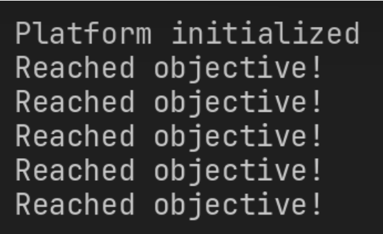
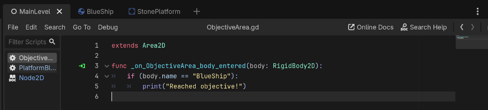
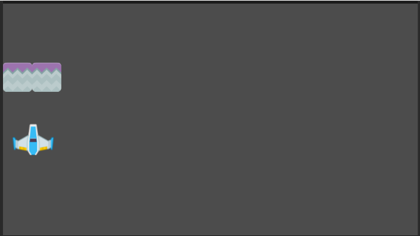

Nama: Micheline Wijaya Limbergh  
NPM: 2306207013

1. Apa saja pesan log yang dicetak pada panel Output?

	Jawab: Reached objective\!   
	

2. Coba gerakkan landasan ke batas area bawah, lalu gerakkan kembali ke atas hingga hampir menyentuh batas atas. Apa saja pesan log yang dicetak pada panel Output?

	Jawab: Reached objective\! ketika menyentuh batas atas saja.   
	

3. Buka scene MainLevel dengan tampilan workspace 2D. Apakah lokasi scene ObjectiveArea memiliki kaitan dengan pesan log yang dicetak pada panel Output pada percobaan sebelumnya?  
   Jawab: Betul. Pesan log terdefinisi di dalam scene MainLevel  
   
   

\======================================================================

1. Scene BlueShip dan StonePlatform sama-sama memiliki sebuah child node bertipe Sprite2D. Apa fungsi dari node bertipe Sprite2D?  
   Jawab: node tersebut menyimpan assets dari game   
     
2. Root node dari scene BlueShip dan StonePlatform menggunakan tipe yang berbeda. BlueShip menggunakan tipe RigidBody2D, sedangkan StonePlatform menggunakan tipe StaticBody2D. Apa perbedaan dari masing-masing tipe node?  
   RigidBody2 \= Dipengaruhi oleh gaya berat terlihat dari componentsnya yang memiliki keterangan mass   
   StaticBody 2D \= Sesuai namanya statis dan terlihat dari componentsnya terdapat constant line dan constang angle   
     
3. Ubah nilai atribut Mass pada tipe RigidBody2D secara bebas di scene BlueShip, lalu coba jalankan scene MainLevel. Apa yang terjadi?  
   Ketika mass di set pada yang paling ringan, pesawat melaju ke atas dengan dorongan yang sangat sedikit bahkan sampai melewati batas atas.   
     
4. Ubah nilai atribut Disabled milik node CollisionShape2D pada scene StonePlatform, lalu coba jalankan scene MainLevel. Apa yang terjadi?  
   Jawab: Stone tidak bergerak  
   
     
5. Pada scene MainLevel, coba manipulasi atribut Position, Rotation, dan Scale milik node BlueShip secara bebas. Apa yang terjadi pada visualisasi BlueShip di Viewport?  
   Jawab: ketika direset dan koordinatnya berubah, stone tidak lagi pada tempatnya melainkan diatas ship. Selain itu titik mulainya juga berubah.   
     
     
6. Pada scene MainLevel, perhatikan nilai atribut Position node PlatformBlue, StonePlatform, dan StonePlatform2. Mengapa nilai Position node StonePlatform dan StonePlatform2 tidak sesuai dengan posisinya di dalam scene (menurut Inspector) namun visualisasinya berada di posisi yang tepat?  
   Jawab: Karena nilai Position pada StonePlatform dan StonePlatform2 dihitung secara relatif terhadap parent node (MainLevel), bukan posisi global, sehingga meskipun angkanya terlihat tidak sesuai di Inspector, visualisasinya tetap berada di posisi yang benar di Viewport.

\======================================================================

Saya mengubah pesawat menjadi redShip dan landasan menjadi grass dengan penempatan objective area di kanan. Selain itu, saya juga menambahkan gerakan tambahan yaitu ke kanan dan ke kiri untuk landasannya. 
